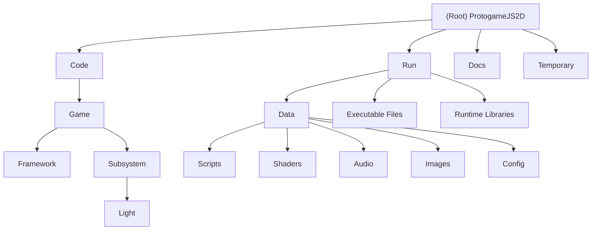

# ProtogameJS2D - Dual-Language Game Framework

## Changelog

- **2025-09-21 20:12:07**: Initial AI context generation - Created comprehensive project documentation with C++/JavaScript dual-language architecture analysis, module structure mapping, and development workflow documentation.

## Project Vision

ProtogameJS2D is a cutting-edge 2D game framework demonstrating advanced dual-language architecture through seamless integration of C++ performance systems and JavaScript flexibility. Built on the DaemonEngine foundation with Google V8 JavaScript engine integration, this project represents a modern approach to game development that combines the performance characteristics of C++ with the rapid prototyping capabilities of JavaScript.

The framework features real-time hot-reloading, Chrome DevTools integration, and a sophisticated script interface system that enables JavaScript game logic to seamlessly interact with C++ engine systems.

## Architecture Overview

### Dual-Language Integration Model
```
Windows Application (C++)
├── DaemonEngine Foundation (External)
│   ├── Core Systems (Math, Renderer, Audio, Input)
│   ├── V8 JavaScript Engine Integration
│   └── Chrome DevTools Support
├── Game Application Layer (C++)
│   ├── Entity System (Player, Props, Entities)
│   ├── Framework Infrastructure (App, Main Loop)
│   ├── Script Interface Bridge (C++ ↔ JavaScript)
│   └── Hot-Reload System (FileWatcher + ScriptReloader)
└── Game Logic Layer (JavaScript)
    ├── JSEngine (System Registration Framework)
    ├── JSGame (Game-Specific Logic)
    └── InputSystem (Modular Input Handling)
```

### Runtime Execution Flow
```
C++ Main Loop (App.cpp):
├── BeginFrame()
├── Update() ──→ Game.UpdateJS() ──→ V8::Execute(JSEngine.update())
├── Render() ──→ Game.RenderJS() ──→ V8::Execute(JSEngine.render())
└── EndFrame()
```

## Module Structure Diagram



## Module Index

| Module | Path | Language | Responsibility | Status |
|--------|------|----------|----------------|--------|
| **Game Core** | `Code/Game` | C++ | Entity system, game state management, main game logic | ✅ Active |
| **Framework** | `Code/Game/Framework` | C++ | Application infrastructure, V8 integration, hot-reload | ✅ Active |
| **JavaScript Engine** | `Run/Data/Scripts` | JavaScript | Game logic layer, system registration, input handling | ✅ Active |
| **Assets** | `Run/Data` | Mixed | Game configuration, shaders, models, audio, textures | ✅ Active |
| **Subsystems** | `Code/Game/Subsystem` | C++ | Game-specific subsystems (lighting, etc.) | 🚧 Developing |

## Running and Development

### Prerequisites
- Visual Studio 2022 with C++20 support
- Windows 10/11 x64
- NuGet Package Manager

### Quick Start
1. **Build the solution:**
   ```bash
   # Open ProtogameJS2D.sln in Visual Studio
   # Select Debug|x64 or Release|x64
   # Build → Build Solution (Ctrl+Shift+B)
   ```

2. **Run the application:**
   ```bash
   cd Run
   ProtogameJS2D_Debug_x64.exe
   ```

3. **Hot-reload development:**
   - Edit JavaScript files in `Run/Data/Scripts/`
   - Changes apply automatically without restart
   - FileWatcher monitors script changes
   - ScriptReloader handles V8 context updates

### Development Workflow
1. **C++ Engine Development**: Modify files in `Code/Game/` and external `Engine/`
2. **JavaScript Game Logic**: Edit files in `Run/Data/Scripts/` with hot-reload
3. **Asset Management**: Add resources to `Run/Data/` subdirectories
4. **Debugging**: Visual Studio for C++, Chrome DevTools for JavaScript

## Testing Strategy

### Current Testing Infrastructure
- **JavaScript Test Scripts**: `Run/Data/Scripts/test_scripts.js`
- **Integration Testing**: C++/JavaScript bridge validation
- **Hot-Reload Testing**: Script modification and reload verification
- **Engine Testing**: V8 subsystem integration validation

### Testing Gaps
- No formal C++ unit testing framework identified
- Limited automated testing infrastructure
- Manual testing predominant

## Coding Standards

### C++ Standards
- **Language Standard**: C++20 with full conformance mode
- **Compiler**: MSVC v143 (Visual Studio 2022)
- **Architecture Patterns**: RAII, SOLID principles
- **Memory Management**: Smart pointers, automatic V8 garbage collection
- **Error Handling**: Exception-safe design with JavaScript error isolation

### JavaScript Standards
- **ECMAScript**: Modern JavaScript with V8 engine support
- **Architecture**: Modular system registration framework
- **Hot-Reload Support**: Version-based change detection
- **Global State Management**: Careful scoping with globalThis

### Integration Standards
- **Interface Design**: Clear C++/JavaScript boundary definitions
- **Type Safety**: std::any with runtime type validation
- **Error Isolation**: JavaScript errors don't crash C++ engine
- **Performance**: Minimize C++/JavaScript crossing overhead

## AI Usage Guidelines

### Recommended AI Assistance Areas
1. **JavaScript Game Logic Development**: AI agents can modify script files with hot-reload
2. **System Configuration Tuning**: Adjust engine parameters and gameplay systems
3. **Asset Pipeline Optimization**: Improve resource loading and management
4. **Testing and Validation**: Generate test cases and validation scripts

### AI Safety Considerations
- **Hot-Reload Boundaries**: AI changes to JavaScript take effect immediately
- **Engine Stability**: C++ modifications require full rebuild and testing
- **State Preservation**: Understand ScriptReloader state management
- **Error Recovery**: Implement robust error handling for AI-generated code

### Integration Points for AI
- **Script Interface**: Use GameScriptInterface for C++ engine interaction
- **System Registration**: Register new JavaScript systems via JSEngine
- **Input Handling**: Modify InputSystem.js for custom input behaviors
- **Runtime Configuration**: Adjust game parameters via JavaScript APIs

## Related Projects

- **DaemonEngine**: External foundation engine (referenced in solution)
- **Google V8**: JavaScript runtime engine v13.0.245.25
- **FMOD**: Audio engine integration
- **Chrome DevTools**: JavaScript debugging support

---

*Generated by Claude AI Context System - Comprehensive dual-language game framework documentation*